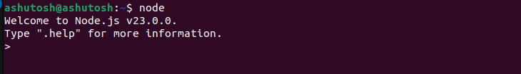
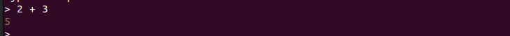
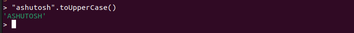
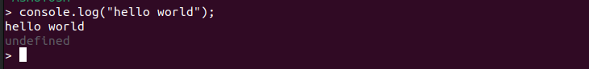
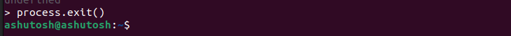
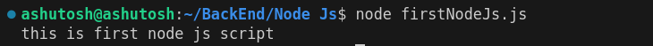

## How to Run Node Js
JavaScript ko or jo functionality hame Node Js provide karta hai wo sab functionality ham chahe to apne terminal me bhi run kar sakte hai.

Node Js ko terminal me run karne ke liye ham pehle node command ko run karenge jise ham Node Js ko run karne ke liye space mil jaaye gi.

ab ham individual node statements ko run kar sakte hai.

**Example**

Terminal me ham 2 + 3 karte hai to hame 5 mile ga.

Jese ki browser me console.log() se ham kuch print kar sakte hai.
Same Node Js me bhi console.log() hota hai.

Jese ki browese me document hota hai wese hee Node Js me process hota hai. yadi hame terminal mese node js ka execution stop karna hai tab ham ``process.exit()`` ka use karenge.

## How Run Js File Using Node Js
Example ke liye hamare pass firstNodeJs.js karke file hai usse hame Node Js ka use karke run karna hai to ham terminal open karke node and file ka name denge jis file ko hame run karna hai.

jese ki hame yaha pe firstNodeJs.js file ko run karna hai to ham ``node firstNodeJs.js`` likhenge.

