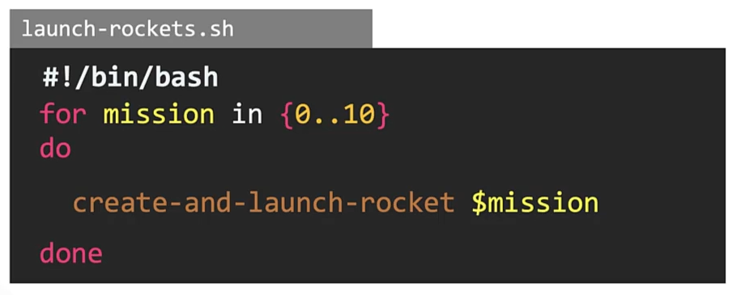

## What is Shebang ?

Shell script hai wo multiple types ki hoti hai.
like : 

Ye jitne bhi different type of shell hoti hai unme kuch fundamental difference hoti hai.

Example

jese ki hamare pass 3 type of shell hai.
1. Bourne shell(sh) 2. Debian Almquist Shell(dash) 3. Bourne again shell(bash)

Ab jese ki hamne ek for loop likha hai.

Ab ye jo loop hai wo only bash shell me hee work karega. yadi ham ise sh and dash shell me run karne ka try karenge to wo right output nahi dega.

yadi hame is loop ko sh shell me run karna hai to shell scrit ko run karte time hame bata na padega ki ye bash type ki shell hai.

Yani ki ham jabhi hamari bash shell script ko kisi ke saath share karenge to hame bata na pade ga ki ye bash shell script hai.

Shebang statement hai wo ek line hoti hai joki ham apne shell script me first line me likhte hai.
Syntax of write Shebang : #!/Path of shell script

Shebang statement hai wo specifie karta hai ki jo hamari script hai wo konse shell me run hogi. like : bash, sh , dash

